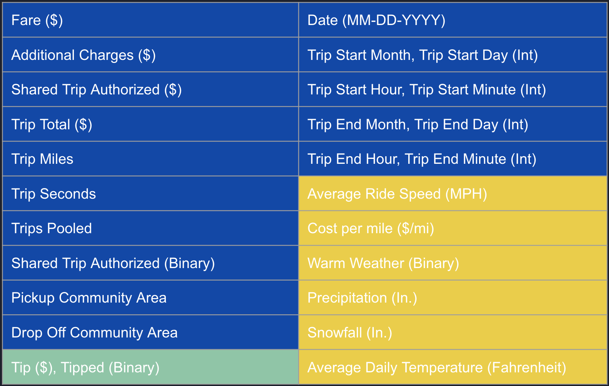

# Ride Hailing Passenger Tipping Behavior In Chicago \n :blue_car: :red_car: :taxi:

### Background Information:
A cursory google search on ride-hailing driver compensation gives the sense that Ride-hailing companies Uber and Lyft notoriously undercompensate their drivers. However, media coverage seems to leave one component of driver compensation out of the conversation: Tips from passengers. The City of Chicago released the first available dataset on individual rides from mobile ride-hailing applications in early 2019. With it, we hope to model the tipping behavior of passengers as well as the factors that contribute to the likelihood that passengers will tip their drivers.

### The Data:
The City of Chicago hosts an open data API found [here](https://data.cityofchicago.org/Transportation/Transportation-Network-Providers-Trips/m6dm-c72p). Individual ride data were pulled from the API for the dates November 1, 2018 - March 31, 2019. All rides that either ended or originated OUTSIDE of the Chicago city limits were excluded from the analysis.

Along with individual rides, daily weather data from the National Oceanic and Atmospheric Association (NOAA) were collected for the same dates and appended to the individual rides according to matching ride dates.

Features (Raw and Engineered):
- Blue features are raw data
- Yellow are engineered features
- Green are outcome variables

    
### Goals:
1. Explore the ride and weather data for bivariate trends related to tips and tip frequency.
2. Produce and tune a binary classifier to predict whether an individual ride will result in the passenger tipping their driver.

### Exploration Takeaways

Overall, daily weather did not have a significant effect on tipping behavior, but perhaps more seasonal weather patterns might indicate changes. Trip distance and trip dropoff and pickup areas contributed most to the predicting the tipping behavior of passengers.

See the presentation slides for more detailed visual data exploration.

### The Model
After multiple model iterations, the best model used a Gradient Boosting Classifier optimized using HyperOpt (Bayesian Model-Optimization) with training data balanced with SMOTE. The model return precision of 87.5% and recall of 88.2% (Overall Accuracy: 88%)

### Conclusions
88% precision and 87.5% recall rates are impressive given that this data are merely external factors that the driver cannot control. Combined with features on the invidual passengers and riders themselves, the model can improve much more, especially since indiviudal driver and rider data are perhaps better indicators of tipping likelihood.

This model could potentially be implemented within the Lyft and Uber apps to provide strategies for drivers to increase their tips. One idea would be to create a live geographic heatmap that visualizes the geographic areas where live ride-hailers are most likely to provide a tip.

Also, by understanding the primary factors that contribute to driver tips, Uber and Lyft can educate their drivers on these factors to improve driver strategy, as well as come up with ways to incentivize passengers to tip their drivers.
